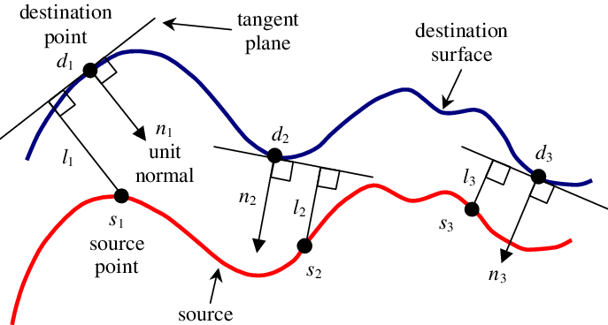
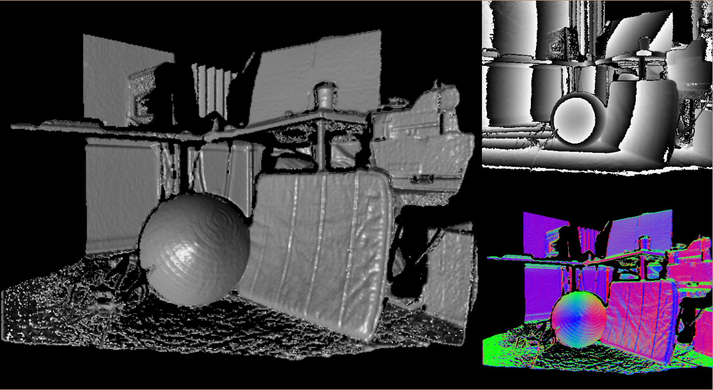

# SLAM Large Dense Scene Real-time 3D Reconstruction
GPU based camera tracking volumetric fusion and rendering.
* Camera Tracking: Track pose in real-time by registering incoming depth image to the TSDF-generated depth map. 
* Volumetric Fusion: With the updated camera pose, fuse the new income depth to the fused TSDF volume in real-time. 
* Volumetric Rendering: Render the fused TSDF volume in real-time.

## GPU Based Real-time RGBD Camera Tracking
### Rigid Iterative Closest Point (ICP) with Projective Correspondence 
To estimate the 6 DoF for camera pose update (3 for rotation and 3 for translation), we use rigid registration algorithm - ICP. The objective function are as follow:

### Generate Depth Image From TSDF volume

## GPU Based Real-time Volumetric Fusion

## GPU Based Real-time Volumetric Rendering with Ray Casting

## Demo
### User Interface

### Output Reconstructed 3D Mesh

### More Examples

## Install
dependency: 
1. VCG library http://vcg.isti.cnr.it/vcglib/ for geometry processing
2. Eigen http://eigen.tuxfamily.org/index.php?title=Main_Page for matrix computation
3. CUDA https://developer.nvidia.com/cuda-downloads for CUDA kernel
4. OpenGL https://www.opengl.org/ for display
5. Microsoft Kinect SDK https://www.microsoft.com/en-us/download/details.aspx?id=44561 
   or libfreenect2 https://github.com/OpenKinect/libfreenect2 for depth strame input from Kinect

